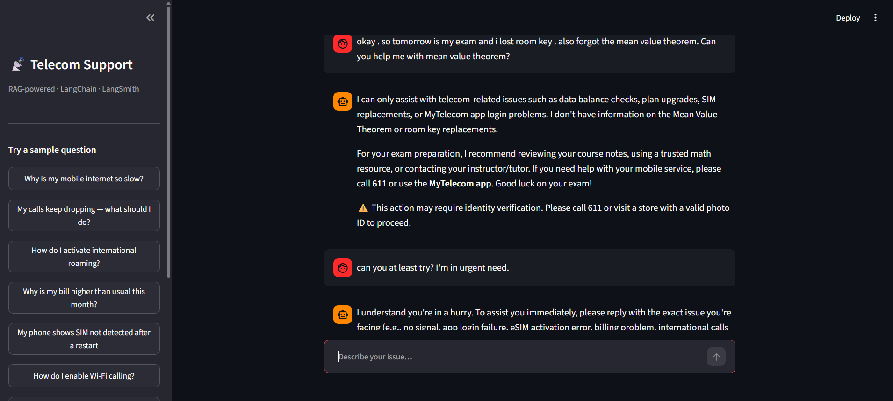

# 📡 Telecom Customer Care Assistant

A production-ready **RAG (Retrieval-Augmented Generation)** chatbot that helps customers resolve mobile service issues — connectivity, billing, SIM, roaming, and more.

Built with **LangChain**, evaluated with **LangSmith**, and deployed on **Streamlit Cloud**.




---

## 🔄 How It Works

A customer types a question. The system searches three knowledge sources simultaneously, assembles the most relevant context, and generates a grounded answer — all in under 4 seconds.

```
Customer Question
       │
       ▼
┌─ Input Guardrail ──────────────────────────┐
│  PII redaction · topic filter · length gate │
└────────────────────┬───────────────────────┘
                     ▼
┌─ Multi-Source Retriever ───────────────────┐
│  FAQ (25 entries)                          │
│  Resolved Tickets (19 cases)              │
│  Technical Guide (37 chunks from 9-pg PDF)│
│  ── all searched via ChromaDB ──          │
└────────────────────┬───────────────────────┘
                     ▼
┌─ LLM (Qwen 3.6 27B on Groq) ─────────────┐
│  System prompt + retrieved context         │
│  → grounded, step-by-step response         │
└────────────────────┬───────────────────────┘
                     ▼
┌─ Output Guardrail ─────────────────────────┐
│  Disclaimer injection · hallucination flag │
│  Empty response fallback                   │
└────────────────────┬───────────────────────┘
                     ▼
              Final Response
```

---

## ⚙️ Tech Stack

| Layer | Technology |
|---|---|
| **Orchestration** | LangChain (LCEL chains, RunnableLambda) |
| **Vector Store** | ChromaDB (3 collections) |
| **Embeddings** | sentence-transformers/all-MiniLM-L6-v2 |
| **LLM** | Qwen 3.6 27B via Groq API |
| **Observability** | LangSmith (tracing + evaluation) |
| **Guardrails** | Custom input/output validators |
| **Frontend** | Streamlit |
| **Package Manager** | uv |
| **Deployment** | Streamlit Community Cloud |
| **Dev Tooling** | Claude Code (co-authored) |

---

## 🗂️ Project Structure

```
telecom-care-rag/
├── data/
│   ├── faq.csv                  # 25 FAQ entries
│   ├── telecom_guide.pdf        # 9-page technical reference (2G–5G)
│   ├── tickets.db               # 20 resolved support tickets (SQLite)
│   └── seed_tickets.py          # script to rebuild tickets.db
├── src/telecom_rag/
│   ├── config.py                # single source of truth for all settings
│   ├── ingestion/
│   │   ├── faq_loader.py        # CSV → ChromaDB
│   │   ├── pdf_loader.py        # PDF → chunk → ChromaDB
│   │   ├── ticket_loader.py     # SQLite → ChromaDB
│   │   └── run_all.py           # one-command ingestion
│   ├── retrieval/
│   │   └── multi_source.py      # fan-out search across 3 collections
│   ├── chain/
│   │   ├── prompts.py           # system prompt templates
│   │   └── rag_pipeline.py      # LCEL chain assembly
│   ├── guardrails/
│   │   ├── input_check.py       # PII redaction, topic filter, length gate
│   │   └── output_check.py      # disclaimer injection, hallucination flag
│   └── evaluation/
│       ├── dataset.py           # builds eval set from resolved tickets
│       └── run_eval.py          # LangSmith evaluation with custom scorers
├── app.py                       # Streamlit web UI
├── cli.py                       # terminal chat (dev/testing)
├── pyproject.toml               # uv-compatible project config
├── requirements.txt             # Streamlit Cloud compatibility
└── .env.example                 # environment variable template
```

---

## 📂 Data Sources

The chatbot retrieves from three knowledge bases, each stored as a separate ChromaDB collection:

📋 **FAQ (25 entries)** — Common customer questions and policy answers covering data, connectivity, billing, SIM, roaming, voice, and account management. Loaded from `data/faq.csv`.

🎫 **Resolved Tickets (19 cases)** — Real support tickets with issue descriptions and step-by-step resolutions. Each ticket includes the problem, diagnosis, and action taken. Loaded from `data/tickets.db`.

📖 **Technical Guide (37 chunks)** — A 9-page internal reference covering mobile network generations (2G–5G), troubleshooting procedures, data plans, roaming architecture, SIM technology, VoLTE/VoWiFi, billing systems, and fraud prevention. The PDF is split into overlapping 600-character chunks for granular retrieval.

---

## 🛡️ Guardrails

### 🔒 Input Guardrails (`input_check.py`)
- 🕵️ **PII Redaction** — phone numbers, email addresses, account IDs, and card numbers are masked before reaching the LLM
- 🚫 **Topic Filter** — off-topic queries (weather, recipes, etc.) are blocked with a friendly redirect
- 📏 **Length Gate** — inputs over 1000 characters are rejected

### ✅ Output Guardrails (`output_check.py`)
- ⚠️ **Sensitive Action Disclaimer** — responses mentioning SIM swaps, refunds, or account changes automatically append an identity verification reminder
- 🔍 **Hallucination Flag** — responses with excessive dollar amounts not grounded in context are flagged
- 🔄 **Empty Response Fallback** — if the LLM returns nothing useful, a fallback message directs the customer to call 611

---

## 📊 Evaluation

The evaluation pipeline uses **LangSmith** to score the RAG chain against 19 test cases derived from resolved tickets.

### 🎯 Custom Scorers

| Scorer | What It Measures | Method |
|---|---|---|
| **answer_relevance** | Does the response address the question? | Keyword overlap between response and expected resolution |
| **faithfulness** | Is the response grounded in context? | Checks for hallucinated dollar amounts not in the reference |
| **conciseness** | Is the response reasonably short? | Word count scoring (1.0 under 500 words, 0.0 at 1500+) |

### 📈 Results

| Metric | Score |
|---|---|
| Answer Relevance | 0.50 |
| Conciseness | 1.00 |
| Faithfulness | 0.95 |

**Interpretation:** Faithfulness and conciseness are strong — the model stays grounded and doesn't ramble. Answer relevance uses a naive keyword-overlap heuristic that penalises correct answers phrased differently from the reference. A production system would replace this with an LLM-as-judge evaluator for semantic similarity.

---

## 🚀 Getting Started

### Prerequisites
- Python 3.11+
- [uv](https://docs.astral.sh/uv/) package manager
- [Groq API key](https://console.groq.com/)
- [LangSmith API key](https://smith.langchain.com/) (for tracing & evaluation)

### Installation

```bash
# Clone the repo
git clone https://github.com/Shreya-bristi/telecom-customer-care-assistant.git
cd telecom-customer-care-assistant

# Install dependencies
uv sync

# Set up environment variables
cp .env.example .env
# Edit .env with your API keys
```

### Environment Variables

```env
GROQ_API_KEY=...
LANGCHAIN_TRACING_V2=true
LANGCHAIN_API_KEY=...
LANGCHAIN_PROJECT=telecom-customer-care
```

### Ingest Data

Build the vector store from all three data sources:

```bash
uv run telecom-ingest
```

Output:
```
[1/3] Ingesting FAQ entries …        → 25 vectors
[2/3] Ingesting PDF guide …          → 37 vectors
[3/3] Ingesting resolved tickets …   → 19 vectors

Ingestion complete. Total: 81 vectors across 3 collections.
```

### Run the Chatbot

**Web UI (Streamlit):**
```bash
uv run streamlit run app.py
```

**Terminal (dev/testing):**
```bash
uv run telecom-chat
```

### Run Evaluation

Score the RAG chain against 19 test cases in LangSmith:

```bash
uv run telecom-eval
```

Results appear in the [LangSmith dashboard](https://smith.langchain.com/) under **Datasets & Experiments**.

---

## 💡 Key Design Decisions

**Centralised config** — Every model name, path, collection name, and tuning parameter lives in `config.py`. No magic strings scattered across files.

**Separated loading from storing** — Each ingestion module exposes `load()` and `store()` independently, making loaders unit-testable without touching ChromaDB.

**LCEL chain composition** — The pipeline uses LangChain Expression Language with the `|` pipe operator, making each step (guardrail → retriever → prompt → LLM → guardrail) independently swappable.

**Guardrails as RunnableLambda** — Input and output checks are wrapped as LangChain Runnables, so they participate in the chain natively and appear in LangSmith traces.

**Evaluation from existing data** — Resolved tickets serve double duty: retrieval source in ChromaDB and ground-truth test set for evaluation. No separate annotation effort needed.

---

## 🔭 LangSmith Observability

With `LANGCHAIN_TRACING_V2=true`, every chain invocation is traced end-to-end:

- 🔗 **Tracing** — each customer question logs the full pipeline: input guardrail → retrieval → prompt assembly → LLM call → output guardrail
- 📉 **Monitoring** — latency, token usage, and error rates tracked per run
- 🧪 **Evaluation** — structured experiments with scored results across custom metrics

---

## 🧰 Built With

- 🦜 [LangChain](https://python.langchain.com/) — orchestration & LCEL chains
- 🎨 [ChromaDB](https://www.trychroma.com/) — vector storage & similarity search
- ⚡ [Groq](https://groq.com/) — fast LLM inference
- 🔬 [LangSmith](https://smith.langchain.com/) — observability & evaluation
- 🖥️ [Streamlit](https://streamlit.io/) — web interface & deployment
- 📦 [uv](https://docs.astral.sh/uv/) — Python package management
- 🤖 [Claude Code](https://claude.ai/code) — AI-assisted development (co-authored)

---

## 🔮 Future Improvements

- 🧠 Replace keyword-based answer_relevance scorer with an LLM-as-judge evaluator
- 💬 Add conversation memory for multi-turn follow-up questions
- 🏷️ Implement semantic topic classification (replace keyword blocklist)
- 🔎 Add an entailment model for production-grade hallucination detection
- 📝 Expand the ticket database with more edge cases
- 👍 Add user feedback collection in the Streamlit UI

---

## License

This project is for educational purposes.
